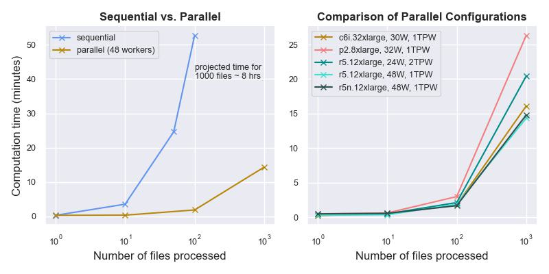
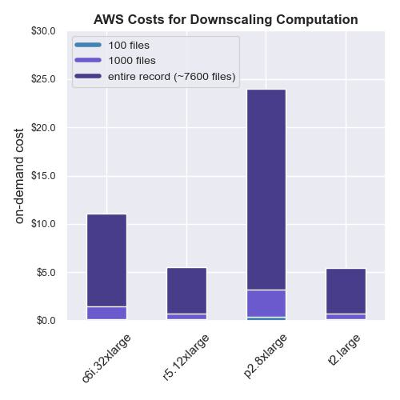

# Ancillary notebooks, scripts, and results for `general_parallelization.ipynb`

**Author**: Dean Henze

This directory contains ancillary notebooks, scripts, and results for the `general_parallelization.ipynb` notebook. This primarily includes an analysis to compare the performance of several AWS EC2 instance types running the code from the notebook.

## Performance/Cost Assessment of EC2 Types Using Dask

**Background**

The computation in `general_parallelization.ipynb` coarsens a MUR SST data product (https://doi.org/10.5067/GHGMR-4FJ04) from 0.01 degree to 1 degree resolution. An example is shown in the below figure. The notebook presents a toy example of processing 10 files but the goal ultimately is to process 100, 1000, 10,000 files. For these larger number of files, computation time and cost become more consequential. The goal of this small assessment is to compare computation times and costs of several EC2 instance types, in order to provide guidance to users in their own computations. 


**Analysis**

AWS offers hundreds of EC2 instance types, which vary in aspects such as number of processors (vCPU's), memory per processor, and processor type. AWS groups these EC2 types into several general use cases such as "general-purpose", "compute-optimized", "memory-optimized", and "accelerated-computing" (while all of these classes have instances of comparable processor numbers, the classes differ in memory per processor and processor type). For this analysis, an EC2 instance was taken from each of these use-cases: a small instance from the "general purpose" case as a control, and larger instances from the other three case types. The code from `general_parallelization.ipynb` was adapted to an exectuable .py script and run on the EC2 instances for 10, 100, and 1000 files. Computation times are output by the .py script, and costs are derived using computation times and AWS Linux on-demand pricing per hour (pricing table included here). Guidance on running the .py script are given in the Directory contents section.   

**Results**





* Computation times for all larger instances reduced computation time of 1000 files from ~8 hrs to ~20 minutes over the small, "general-purpose" control instance.
* It was found that for our computation, each worker (e.g. processor, or vCPU) required at least ~6 GB of memory. This limited the maximuim number of processors that could be asked for from each type.
* The memory-optimized instances performed the best both in terms of cost and performance. The compute-optimized performed almost as well, and the fact a fewer number of processors could be run (due to lower memory per processor), suggested that these might be better if our computation required less memory per processor.
* The accelerated-computing instance performed the slowest despite costing the most per hour. This demonstrated that these instance types do not necessarily perform the best "out of the package" for an arbitrary task, and require more technical knowledge to utilize.
* Two memory-optimized instances were tested, which were identical other than bandwidth. For these, the computation time did not seem to be affected by larger bandwidth. 

## Directory Contents

`dscale_s3_dask.ipynb` walks through downscaling 10 MUR 1 km files via S3 connection, comparing computation times with and without dask. In summary, it takes half the time to downscale the files when using two dask workers, as expected.

`dscale_s3_dask.py` generalizes the code in `dscale_s3_dask.ipynb` to make it easier to plug and play on any EC2 instance. It has a callable function to set parallel computing parameters and number of files analyzed, saving the downscaled files to `./sst_downscaled`. Example usage:
```
import dscale_s3_dask as dscale
dscale.downscale_with_parallel(n_workers=24, threads_per_worker=2, n_files=100) # n_files is the number of files to process.
```

## Other Resources

*AWS EC2 instance characteristics:*
* [Tables for memory, bandwith, vCPU count](https://aws.amazon.com/ec2/instance-types/)
* [Tables for CPU cores and threads per core](https://docs.aws.amazon.com/AWSEC2/latest/UserGuide/cpu-options-supported-instances-values.html)
* [AWS discussion of CPU options](https://docs.aws.amazon.com/AWSEC2/latest/UserGuide/instance-optimize-cpu.html)

